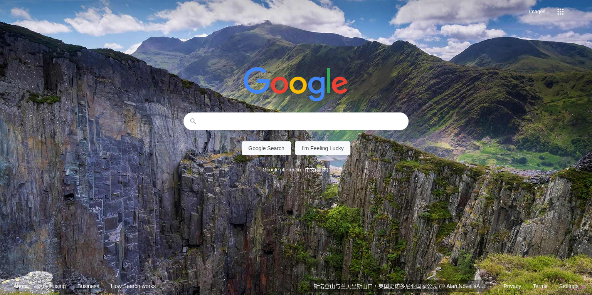

# Bing Wallpaper for Google
Apply the "Today on Bing" wallpapers to the homepage of Google.

## Set up
This is a standalone [user script](https://openuserjs.org/about/Userscript-Beginners-HOWTO) instead of a pre-packaged browser extension. 

So, to set up this script, an additional browser-specific userscript manager (i.e. extension) is needed at first. There are lots of implementations, such as [Tampermonkey for Chrome](https://chrome.google.com/webstore/detail/tampermonkey/dhdgffkkebhmkfjojejmpbldmpobfkfo) and [Greasemonkey for Firefox](https://addons.mozilla.org/en-US/firefox/addon/greasemonkey/). A inclusive list for different platforms/browsers is [here](https://openuserjs.org/about/Userscript-Beginners-HOWTO).

After installing a userscript manager, just clicking on [this](https://github.com/Gowee/bing-wallpaper-for-google/raw/master/bing-wallpaper-for-google.user.js) or following [this](https://greasyfork.org/en/scripts/398204-bing-wallpaper-for-google) will let the userscript manager prompt to apply this script.

---

[Migrated from GreasyFork](https://greasyfork.org/scripts/398204) 
with the help of [greasygit](https://github.com/Gowee/greasygit).

